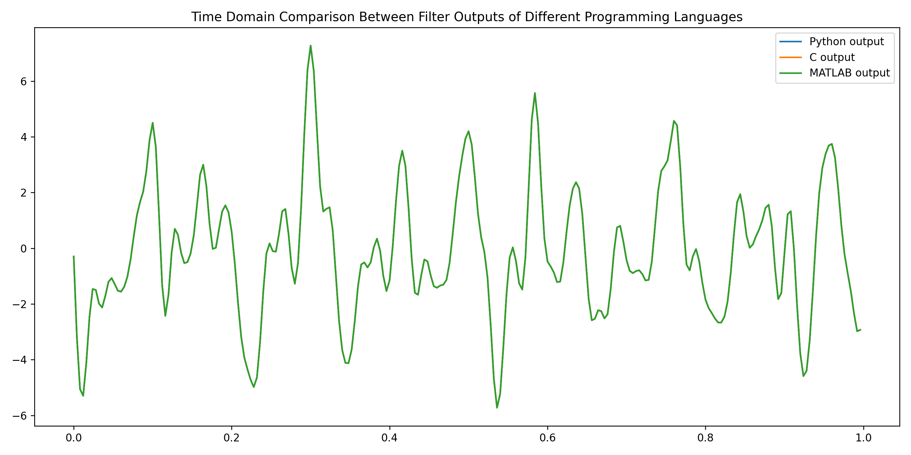
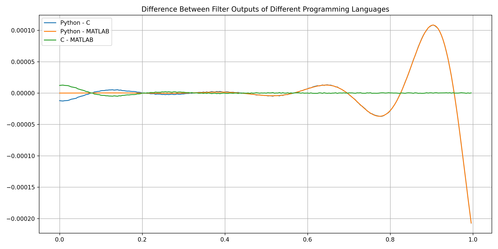
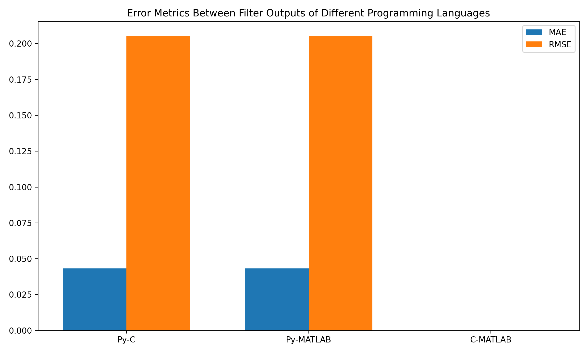
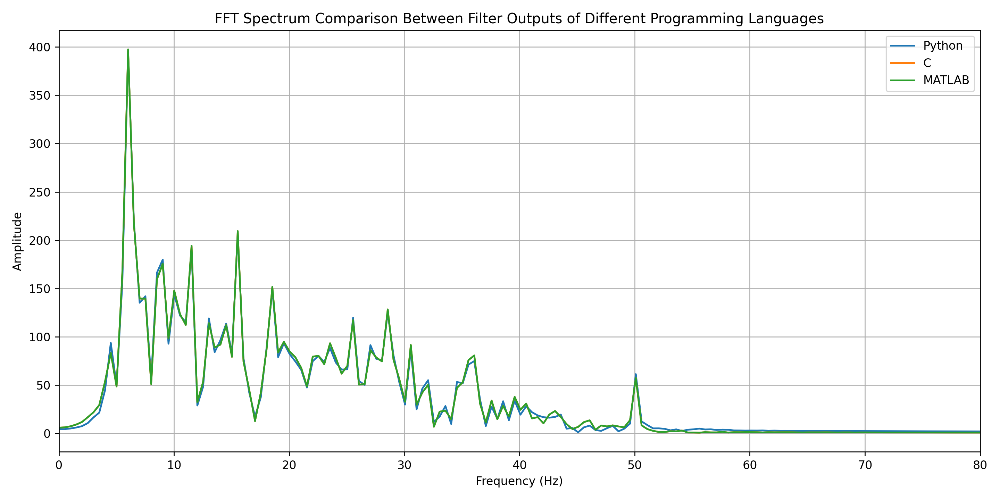

# Zero-Phase Digital Filter in Pure C

## 📌 Project Overview

This project implements a **zero-phase digital IIR filter in pure C language**, aiming to achieve the same numerical precision as:

- MATLAB `filtfilt()`
- Python `scipy.signal.filtfilt()`

Filter coefficients are designed using MATLAB/Python and exported to C for embedded-level execution.

The goal is to reproduce high-precision zero-phase filtering behavior in a lightweight, portable C implementation.



---

## 🚀 Motivation

In many embedded and biomedical signal processing applications (e.g., EEG, ECG, PPG), phase distortion is unacceptable.

The standard solution in high-level environments is:

```bash
filtfilt() → forward-backward filtering
```

However, MATLAB and Python implementations cannot be directly deployed to embedded systems.

This project provides:

- A pure C zero-phase IIR filter
- Edge padding compensation
- Initial condition calculation
- Precision benchmarking against MATLAB and Python

> If you need more technical details, please refer to my blog: <a href="https://blog.csdn.net/weixin_43715601/article/details/143576554">C语言实现IIR型零相位带通滤波器</a>

---

## 🧠 Core Features

### 1️⃣ Zero-Phase Filtering

We implement forward-backward filtering:

1. Forward filtering  
2. Reverse signal  
3. Backward filtering  

This eliminates phase distortion.

---

### 2️⃣ Edge Compensation Strategy

To avoid edge distortion, we use:

- Symmetric edge padding
- Proper initial state computation

This ensures numerical stability and minimizes transient artifacts.

---

### 3️⃣ Precision Benchmark

We compare outputs among:

- MATLAB `filtfilt()`
- Python `scipy.signal.filtfilt()`
- Pure C implementation

### Result:

The numerical difference between all three implementations is accurate up to:

`6 decimal places`

MAE and RMSE remain extremely small, confirming numerical consistency.

---

## 📊 Visualization

The project generates:

- Time-domain comparison
- Difference curves
- Error metrics (MAE / RMSE)
- FFT spectrum comparison

All figures are automatically saved in the `figures/` directory.








---

## 🔬 Technical Specifications

- 4th-order Butterworth Bandpass Filter
- Sampling rate: 250 Hz
- Band: 4–40 Hz
- Optional 50 Hz notch filter
- Zero-phase forward-backward filtering
- Double precision floating-point implementation

---

## 🎯 Application Scenarios

- EEG signal preprocessing
- Biomedical signal filtering
- Embedded DSP systems
- Real-time physiological monitoring devices

---

## 🏁 Conclusion

This project demonstrates that:

> A carefully designed pure C implementation can achieve nearly identical numerical precision to MATLAB and Python `filtfilt()`.

It provides a reliable solution for deploying high-precision zero-phase filters in embedded systems.

---

